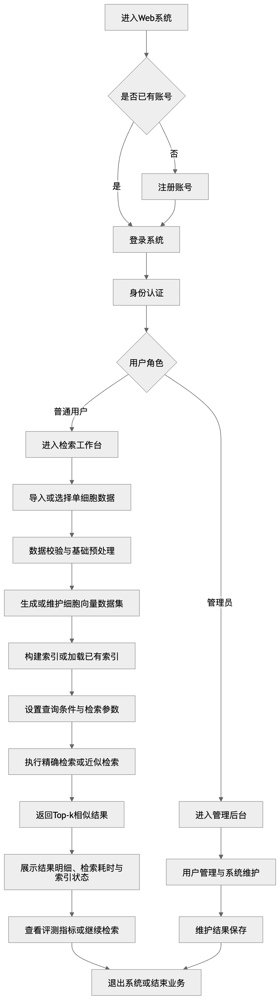
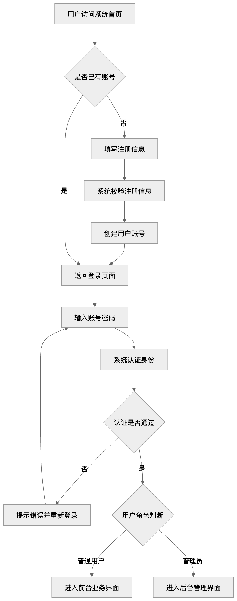
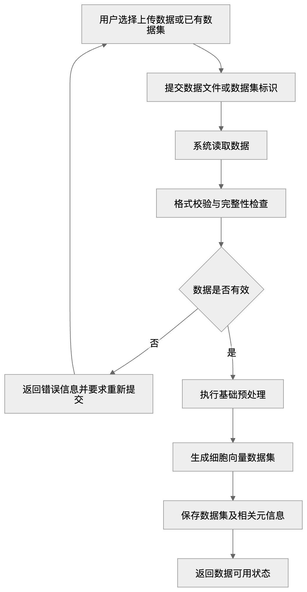
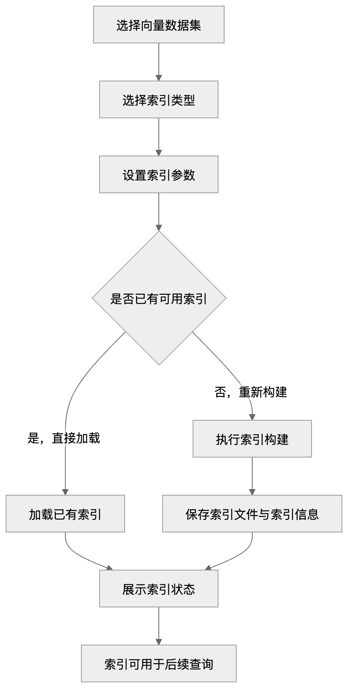
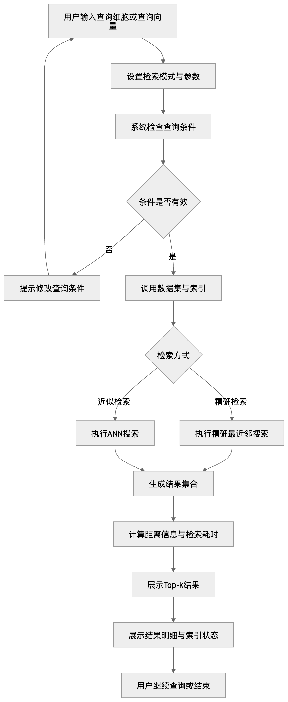
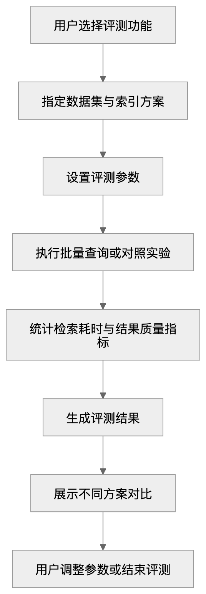
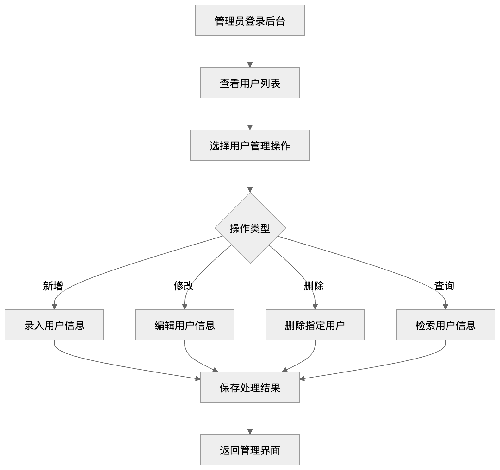
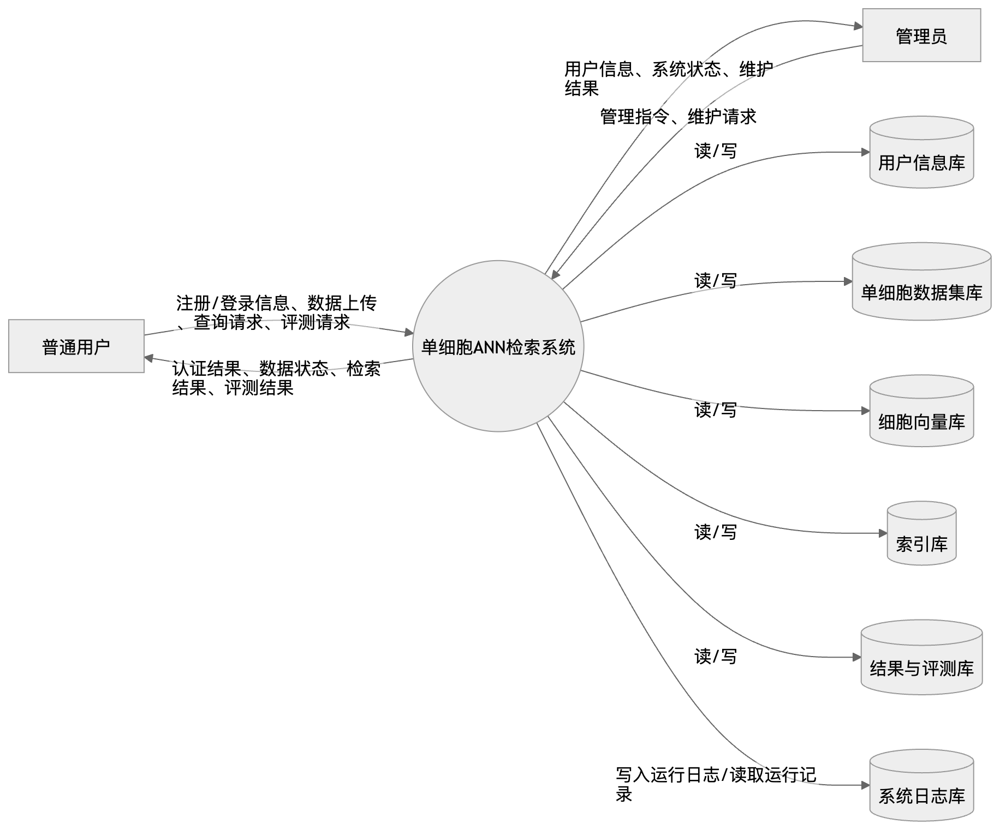
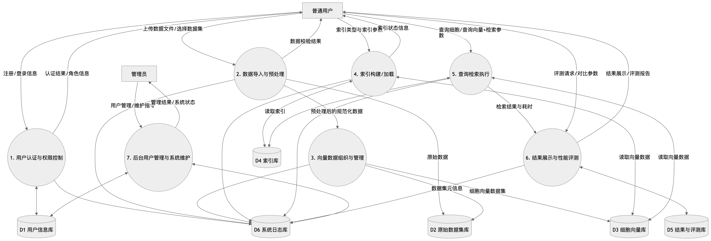

# 面向单细胞高维向量数据的近似最近邻（ANN）检索系统需求分析

## 摘要

本报告围绕“面向单细胞高维向量数据的近似最近邻（Approximate Nearest Neighbor, ANN）检索系统”课程作业展开，重点说明系统在本次作业中的需求范围、业务主线、核心数据组织方式、功能模块划分、性能与非功能要求以及运行环境约束。报告从课程实现角度出发，不将系统描述为过于理想化的大型分析平台，而是聚焦于“能落地、能画图、能实现、能演示”的作业目标。当前版本以单细胞向量数据的导入、基础预处理、索引构建、精确/近似检索、结果展示和性能评测为核心实现内容，并通过业务流程图、数据流图和数据字典等方式对系统结构进行系统化分析。整体设计强调在课程作业范围内把检索主链路跑通，同时为后续的功能细化、数据库设计和系统实现提供明确依据。

## 引言

### 编写目的

本报告面向“开发一个面向单细胞高维向量数据的近似最近邻（ANN）检索系统”这一任务，说明本系统在本次作业中的需求范围。报告重点描述系统面向哪些用户、准备实现哪些功能、涉及哪些数据、运行时需要满足哪些条件，以及各部分之间的业务关系。

本次需求分析主要服务于后续的业务流程图、数据流图、数据字典、功能设计和系统实现。对小组内部而言，这份文档也用于统一实现范围和功能边界，避免后续分工时出现理解不一致、模块重复开发或实现范围不断扩大的情况。

另外，本报告同时面向课程作业评审场景，因此在写法上以“能落地、能画图、能实现、能演示”为主。当前版本重点说明本次作业准备做到什么程度，而不是将系统描述为一个过于理想化的大型平台。

### 项目背景

随着单细胞测序技术的发展，单次实验往往可以产生大量细胞样本。经过数值化表示后，每个细胞都可以看作一个高维向量。在这样的数据背景下，经常需要找到与目标细胞表达模式相近的细胞集合，用于相似样本查找、状态比较和跨数据集匹配。

如果直接对所有细胞做精确最近邻搜索，当数据规模较大、向量维度较高时，查询速度会明显下降，计算开销也会增加。对于课程作业中的系统实现来说，只做精确检索虽然结果更标准，但难以体现高维向量检索系统的特点。

因此，本项目选择以 ANN 检索作为核心方案，并结合 Web 页面完成数据导入、索引构建、查询检索、结果展示和性能评测。从课程实现角度看，这一选题既能体现高维数据检索的特点，又适合与数据管理、Web 展示、性能评测结合起来，形成一个较完整的信息系统。

## 任务概述

### 任务目标

#### 总体目标

本系统主要解决这样一个问题：当单细胞数据量较大时，如何在保证结果基本有效的前提下，提高相似细胞查询的速度，并将查询过程和结果清楚展示给用户。

#### 核心实现目标

本次作业中，系统优先实现以下内容：

1. 支持单细胞数据导入；
2. 支持基础预处理与向量组织；
3. 支持构建和管理典型索引；
4. 支持精确检索与 ANN 检索两种方式；
5. 支持 top-k 结果展示；
6. 支持查询耗时、索引状态和基础评测指标展示。

当前版本支持 NumPy Flat 基线以及 FAISS Flat、IVF、HNSW 和 PQ 五类索引名称。其中 Flat 用作精确检索基线，IVF、HNSW 和 PQ 用于近似检索对比。查询度量支持 L2、Cosine 和 Inner Product（IP）。

#### 课程作业目标

对于本次作业而言，我们不仅要实现一个可以运行的检索系统，还要把它的业务流程、数据组织方式、功能边界和运行条件说明清楚，便于后续完成业务流程图、数据流图、数据字典以及系统设计内容。当前版本重点是把检索主链路跑通，并形成可演示、可说明、可继续细化的需求分析文档。

### 用户特点

对本系统而言，主要用户有两类：普通用户和管理员。

普通用户是系统的主要使用对象。他们通过系统完成数据导入、索引构建、参数设置、查询检索和结果查看。对这类用户来说，最关心的通常不是索引内部实现细节，而是能否顺利导入数据、完成查询，并直观看到 top-k 结果、查询耗时和当前索引类型。

管理员主要负责账户维护、基础配置和运行状态查看。管理员功能用于保证系统能够正常运行，但不作为本项目的重点实现内容。当前版本中，管理员功能以基础账户维护为主，不追求复杂权限体系，也不展开复杂多用户协同场景。

结合课程实现范围，本系统更适合被理解为“检索系统使用者的工具”，而不是“完整单细胞分析流水线平台”。本系统不处理原始测序质控、复杂生物学注释和上游实验流程，普通用户默认面对的是已经整理成结构化矩阵或向量形式的数据。

### 假定与约束

**假定 1：输入数据已经过基础整理。**

本系统假定输入数据能够表示为“细胞×特征”的矩阵，或能够进一步转换为高维向量。本项目不处理原始测序数据的上游实验流程。

**假定 2：系统以检索任务为核心。**

当前版本重点实现数据导入、向量组织、索引构建、查询检索、结果展示和基础评测，不扩展到复杂注释分析、跨模态联合分析和大规模可视化探索。

**约束 1：以课程作业规模为主。**

系统采用单机或小规模部署方式，重点保证功能完整和演示效果，不追求工业级并发能力。当前版本仅考虑单机部署下的课程演示需求。

**约束 2：以代表性索引方案为主。**

本次实现选择少量典型索引方法进行对比，不追求覆盖全部 ANN 算法。为控制实现复杂度，系统暂不考虑过多索引类型和复杂参数搜索流程。

**约束 3：评测以演示为主。**

评测功能主要用于展示不同索引方案在速度和结果效果上的差异，不追求严格科研 benchmark。当前版本重点比较平均查询时间、Recall@k 和索引构建时间等基础指标。

**约束 4：后台功能保持简化。**

管理员模块只保留必要的用户维护、日志查看和基础运行支持，不展开复杂权限分级、审批流、多租户管理等内容。

## 业务描述

本系统的核心业务可以概括为：用户登录系统后导入单细胞数据，完成基础预处理和向量组织，再构建或加载索引，在设置查询参数后执行精确检索或 ANN 检索，并查看 top-k 结果、查询耗时和评测信息；管理员则负责基础账户维护和运行支撑。

### 系统总业务流程图及其描述

系统的核心业务链路可以概括为“用户登录—数据导入—向量生成—索引构建或加载—查询检索—结果展示与评测”。其中，查询检索是系统核心，数据准备和索引组织是支撑环节。

普通用户和管理员登录后使用同一工作台；管理员额外看到用户、数据集和索引删除控件，普通用户不显示这些破坏性操作。

从本项目的实现重点来看，前台检索流程是主要业务，后台流程只保留基础支撑功能。当前版本优先保证检索主链路跑通，不追求在后台部分实现过多扩展能力。

### 各个子业务流程图及其描述

#### 用户登录与访问控制子业务流程

该流程主要解决用户如何进入系统并获得对应权限的问题。输入是注册信息或登录信息，输出是认证结果和角色分流结果。

普通用户注册后可以登录进入工作台，管理员在同一界面获得额外管理控件。若账号或密码错误，系统返回明确提示并允许重新登录。

该流程主要用于保证系统具备基本访问控制能力，不作为本项目的重点创新内容。当前版本仅实现基础账号控制和角色区分。

#### 单细胞数据导入与预处理子业务流程

该流程主要解决检索前的数据准备问题。当前版本支持 H5AD、NPY 与 CSV 格式输入。用户可以上传新数据，也可以选择已有数据集。

系统读取数据后，首先检查样本数、特征维度、文件格式和非法数值。数据通过校验后再进行连续 `float32` 向量组织，输出可直接用于建索引和查询的细胞向量集合及其元信息。

如果数据格式错误、维度异常或缺失严重，系统返回错误信息并中止后续流程。该流程只做面向检索的基础预处理，不展开复杂生物学分析。

#### 索引构建与管理子业务流程

该流程主要解决如何为向量数据建立可复用的索引。输入是向量数据集、索引类型和参数设置，输出是可用索引及其状态信息。

当前版本支持 NumPy Flat 与 FAISS Flat、IVF、HNSW、PQ。系统支持索引构建、保存、加载、切换和状态查看，持久化索引同时绑定数据集记录和语义指纹。

如果当前数据集已经存在可用索引，系统允许直接加载；如果索引不存在或失效，则重新构建。该流程的关键异常点主要是参数不合法、索引文件缺失或索引构建失败。

#### 查询检索与结果展示子业务流程

该流程是系统的核心流程。用户可以输入查询细胞编号，或直接输入查询向量，并设置查询模式、距离度量方式和 top-k 参数。

系统根据当前数据集和索引状态执行精确检索或 ANN 检索，返回排序后的 top-k 结果，同时展示距离值、查询耗时和所用索引类型。当前版本以单次查询为主，并保存基础查询历史；不涉及复杂历史分析和多用户并发检索场景。

该流程的关键异常点包括查询对象不存在、索引未加载、参数范围不合法和查询执行失败等。系统在这些情况下需要给出明确提示。

#### 性能评测与对比分析子业务流程

该流程用于展示不同索引方案的效果差异。输入是数据集、索引方案和评测参数，输出是对比结果和指标展示。

当前版本重点比较平均查询时间、Recall@k、索引构建时间以及不同 top-k 下的结果差异。评测模块的目的不是构建严格科研 benchmark，而是帮助用户直观看到不同索引方案之间的速度与效果差异。

关键异常点主要包括评测参数设置不完整、对比方案不可用以及统计过程失败等。系统需要保证评测结果与当前数据集、索引方案一一对应。

#### 管理员用户管理子业务流程

该流程主要包括用户信息查看、基础账户维护和全局历史查看。管理员登录后台后，可以查询用户并删除非当前账户；普通用户通过公开注册入口新增。

考虑到本项目重点在检索业务，后台管理部分只实现必要功能，不作为核心展示内容。该流程的主要作用是保证系统具备基本的信息系统结构，而不是扩展成复杂的后台管理平台。

## 数据需求

### 数据需求描述

本系统的数据以单细胞向量数据为核心，同时配套管理数据集元信息、索引信息、查询结果、评测记录和用户账户信息。

从作用来看，系统中的数据可分为三类。第一类是**业务核心数据**，直接服务于检索主链路，主要包括数据集、向量、索引和检索结果。第二类是**业务过程数据**，用于记录系统运行过程，主要包括查询请求、评测结果、索引状态和运行状态。第三类是**管理支撑数据**，主要包括用户信息、角色信息和日志信息。

从数据组织关系看，本系统具有较明显的前后依赖链：数据集经过预处理后形成向量集；向量集用于构建索引；索引与查询参数共同决定检索结果；检索结果进一步用于性能评测；用户和日志数据贯穿整个系统运行过程。

当前版本中，核心数据重点放在“数据集—向量—索引—结果”这条主线上。管理支撑数据用于完善系统结构，但不是本项目的实现重点。

### 数据流图

#### 系统顶层数据流图

顶层数据流图主要说明三类内容：外部实体是谁、系统内部有哪些核心处理对象、系统依赖哪些主要数据存储。对本系统来说，外部实体包括普通用户和管理员；核心处理对象是单细胞 ANN 检索系统；核心数据存储包括用户信息库、数据集库、向量库、索引库、结果与评测库以及日志库。

#### 主要处理层数据流图

在系统内部，最核心的数据流为“数据导入 → 校验与向量组织 → 索引构建/加载 → 查询执行 → 结果展示与评测”。向量和索引文件是查询支撑，SQLite 只保存查询摘要和评测快照，运行日志写入轮转文件。

当前图用于课程范围的数据流说明，重点表达外部实体、处理过程和持久化存储之间的关系。

### 数据字典

本节以最终物理实现为准。系统采用“元信息入 SQLite、上传数据与索引本体落盘”的方式；向量不设独立数据库表，每条 Top-K 结果和原始查询向量也不持久化。早期数据流图中的“向量库”、“结果库”和“日志库”是逻辑存储项，在最终实现中分别映射为数据文件、摘要历史表和轮转日志文件。

#### 数据存储项定义

见下表。

**表：数据存储项定义**

| 编号 | 数据存储名称 | 主要内容 | 关键字段 | 来源 | 去向 |
| --- | --- | --- | --- | --- | --- |
| D1 | `users` | 用户账号、密码摘要和角色 | id, username, password_hash, role, created_at | 注册、管理员维护 | 认证、权限控制 |
| D2 | `datasets` | 受管数据集元信息和活动状态 | id, name, stored_path, file_format, use_obsm, n_cells, dim, fingerprint, is_active | 数据导入 | 数据切换、索引和查询 |
| D3 | 数据文件（无独立表） | H5AD、NPY 或 CSV 原上传文件，加载后形成连续 `float32` 向量 | stored_path, use_obsm, semantic fingerprint | 数据导入 | 索引构建、查询 |
| D4 | `index_artifacts` + 索引文件 | 索引清单、数据集绑定、参数和文件校验 | id, dataset_id, dataset_fingerprint, index_type, metric, parameters, stored_path, artifact_fingerprint | 索引构建 | 索引加载、管理 |
| D5 | `query_logs` / `evaluation_logs` | 查询摘要和评测快照；不存原始向量或每条 Top-K 结果 | user_id, dataset_id, query_mode, top_k, query_ms, results, created_at | 检索、评测 | 历史展示 |
| D6 | 轮转日志文件 | 请求路径、状态码、耗时和异常摘要 | timestamp, level, method, path, status, elapsed | Flask 运行时 | 运维排查 |

#### 主要数据流定义

见下表。

**表：主要数据流定义**

| 数据流名称 | 含义说明 | 组成内容 | 来源 | 去向 |
| --- | --- | --- | --- | --- |
| 注册信息 | 用户提交的注册数据 | 用户名、密码 | 普通用户 | 用户认证与权限控制 |
| 登录信息 | 用户登录凭证 | 用户名、密码 | 普通用户/管理员 | 用户认证与权限控制 |
| 认证结果 | 系统返回的认证结果 | 是否通过、角色信息、错误提示 | 用户认证与权限控制 | 普通用户/管理员 |
| 数据上传信息 | 用户提交的数据内容 | 数据文件、数据集名称、`use_obsm`、是否激活 | 普通用户 | 数据导入与预处理 |
| 数据校验结果 | 数据有效性检查结果 | 是否有效、错误原因、处理状态 | 数据导入与预处理 | 普通用户 |
| 已校验向量数据 | 经读取和类型转换后的结构化数据 | 连续 `float32` 矩阵、细胞 ID、元信息 | 数据导入与预处理 | 向量组织与管理 |
| 细胞向量数据 | 用于检索的向量集合 | 向量集编号、维度、存储路径 | 向量组织与管理 | 向量库、索引构建、查询检索 |
| 索引构建参数 | 用户设置的索引信息 | 索引类型、参数配置、目标数据集 | 普通用户 | 索引构建/加载 |
| 索引状态信息 | 系统反馈的索引状态 | 索引类型、可用状态、构建时间 | 索引构建/加载 | 普通用户 |
| 查询请求 | 用户发起的检索请求 | 查询对象、top-k、距离方式、检索模式 | 普通用户 | 查询检索执行 |
| 检索结果 | 系统返回的相似结果 | 结果列表、距离值、排序信息 | 查询检索执行 | 结果展示与性能评测 |
| 评测请求 | 用户发起的评测请求 | 数据集、索引方案、参数组合、评测指标 | 普通用户 | 结果展示与性能评测 |
| 评测结果 | 系统形成的评测输出 | 查询耗时、Recall@k、对比结果 | 结果展示与性能评测 | 普通用户 |
| 管理指令 | 管理员发出的后台请求 | 新增、修改、删除、查询、维护操作 | 管理员 | 后台管理与系统维护 |
| 日志信息 | 系统运行记录 | 时间、模块、状态、异常描述 | 各处理模块 | 系统日志库 |

#### 核心数据结构定义

**（1）用户信息**

见下表。

**表：用户信息结构**

| 字段名 | 含义 | 类型 | 说明 |
| --- | --- | --- | --- |
| id | 用户编号 | Int | SQLite 主键，新库不复用已删除编号 |
| username | 用户名 | String | 登录账号名 |
| password_hash | 密码摘要 | String | 加密存储后的密码信息 |
| role | 用户角色 | String | 普通用户 / 管理员 |
| created_at | 创建时间 | Datetime | 账号建立时间 |

**（2）数据集信息**

见下表。

**表：数据集信息结构**

| 字段名 | 含义 | 类型 | 说明 |
| --- | --- | --- | --- |
| id | 数据集编号 | Int | 数据集唯一标识 |
| name | 数据集名称 | String | 大小写不敏感唯一名称 |
| original_filename | 原文件名 | String | 只保留安全基名 |
| stored_path | 受管路径 | String | 数据根目录内的相对路径 |
| file_format | 文件格式 | String | h5ad / npy / csv |
| source_type | 数据来源类型 | String | 上传数据 / 系统已有数据 |
| use_obsm | AnnData 表示 | String / Null | 所选 `obsm` 键；Null 表示 X |
| n_cells / dim | 向量规模 | Int | 细胞数和向量维度 |
| metadata_fields | 元信息列 | JSON | 可用 obs 字段名 |
| fingerprint | 语义指纹 | String | 绑定文件、表示、向量和行顺序 |
| owner_id / is_active | 所有者与活动状态 | Int / Bool | 导入用户和当前数据集 |
| created_at | 创建时间 | Datetime | 数据集记录建立时间 |

**（3）细胞向量信息**

见下表。

**表：细胞向量信息结构**

| 字段名 | 含义 | 类型 | 说明 |
| --- | --- | --- | --- |
| vectors | 细胞向量 | Float32 Matrix | 连续的 `n_cells × dim` 内存矩阵 |
| cell_ids | 细胞标识 | String Array | 与向量行一一对应且顺序纳入指纹 |
| obs | 细胞元信息 | Map | H5AD/CSV 中的分类信息 |
| record_id / fingerprint | 持久化绑定 | Int / String | 关联 `datasets` 并防止跨表示串用 |

上述是运行时 `CellDataset` 结构，不是独立 SQLite 表。系统保留经校验的原上传文件，激活时按 `use_obsm` 加载为连续 `float32` 矩阵。

**（4）索引信息**

见下表。

**表：索引信息结构**

| 字段名 | 含义 | 类型 | 说明 |
| --- | --- | --- | --- |
| id / name | 索引编号与名称 | Int / String | 按数据集指纹约束名称 |
| dataset_id / dataset_fingerprint | 数据集绑定 | Int / String | 加载时两者均必须匹配 |
| index_type / metric | 索引与度量 | String | flat/faiss/ivf/hnsw/pq 与 l2/cosine/ip |
| dim / n_items / parameters | 规模与参数 | Int / JSON | 维度、条目数和索引参数快照 |
| stored_path / manifest_path | 文件路径 | String | 索引根目录内的相对路径 |
| artifact_fingerprint / library_version | 校验信息 | String | 文件 SHA-256 和构建库版本 |
| owner_id / created_at | 所有者与时间 | Int / Datetime | 保存用户与创建时间 |

**（5）查询请求信息**

见下表。

**表：查询请求信息结构**

| 字段名 | 含义 | 类型 | 说明 |
| --- | --- | --- | --- |
| id | 查询记录编号 | Int | `query_logs` 主键 |
| user_id | 发起用户编号 | Int | 删除用户时同步清理 |
| dataset_id / dataset_fingerprint | 数据集快照 | Int / String | 查询时的数据集身份 |
| query_mode | 查询输入方式 | String | cell / vector |
| query_cell_id | 查询细胞编号 | Int / Null | 向量查询时为 Null；原向量不落库 |
| index_type / metric | 索引与度量 | String | 实际执行的索引以及 l2/cosine/ip |
| top_k | 返回数量 | Int | 返回前 k 个结果 |
| filters / query_ms / returned | 条件与结果摘要 | JSON / Float / Int | 条件、耗时和返回数 |
| created_at | 查询时间 | Datetime | 记录建立时间 |

**（6）检索结果信息**

见下表。

**表：检索结果信息结构**

该结构只在 API 响应和当前前端会话中存在，不作为数据库表持久化。

| 字段名 | 含义 | 类型 | 说明 |
| --- | --- | --- | --- |
| cell_id / cell_name | 细胞编号与名称 | Int / String | 查询数据集中的行位置和标识 |
| cell_type | 细胞类型 | String / Null | 来自数据集元信息 |
| distance | 距离或得分 | Float | L2/Cosine 越小越近，IP 越大越相似 |
| rank | 排名 | Int | 由返回顺序表示，前端从 1 起显示 |

**（7）评测结果信息**

见下表。

**表：评测结果信息结构**

| 字段名 | 含义 | 类型 | 说明 |
| --- | --- | --- | --- |
| id / user_id | 评测编号与用户 | Int | `evaluation_logs` 主键和发起者 |
| dataset_id / dataset_fingerprint | 数据集快照 | Int / String | 评测数据集身份 |
| top_k / n_queries / metric | 评测参数 | Int / String | 请求 K、实际查询数和度量 |
| index_types | 索引集合 | JSON | 本次对比的索引类型 |
| results | 评测快照 | JSON | 每个索引的 effective K、Recall、平均查询与构建耗时 |
| created_at | 评测时间 | Datetime | 记录建立时间 |

## 功能需求

### 功能划分

从系统实现重点看，查询检索、索引管理和数据导入是核心模块；用户管理和运行支撑模块主要用于完善系统结构。结合业务主线，当前版本将系统划分为六个一级模块：

1. 用户与权限管理；
2. 数据导入与预处理；
3. 索引管理；
4. 查询检索；
5. 结果展示与评测；
6. 系统运行支撑。

系统功能模块划分见下表。

**表：系统功能模块划分**

| 一级功能模块 | 主要子功能 | 功能作用 |
| --- | --- | --- |
| 用户与权限管理 | 注册、登录、退出、角色识别、用户维护 | 提供基础访问控制并区分普通用户与管理员 |
| 数据导入与预处理 | 数据上传、读取、校验、基础预处理、向量组织 | 将输入数据整理为可检索的向量数据 |
| 索引管理 | 索引选择、参数设置、构建、保存、加载、切换、状态查看 | 为高效检索建立和管理索引资源 |
| 查询检索 | 查询输入、参数设置、精确检索、ANN 检索、结果生成 | 完成系统核心的相似细胞搜索任务 |
| 结果展示与评测 | 结果展示、耗时反馈、索引状态反馈、评测对比 | 帮助用户理解检索效果和方案差异 |
| 系统运行支撑 | 日志记录、异常提示、基础配置、运行状态管理 | 保障系统稳定运行 |

### 功能描述

#### 用户与权限管理模块

该模块负责用户注册、登录、退出和角色识别。普通用户与管理员进入同一检索工作台，管理员额外获得破坏性资源操作和用户维护权限，不扩展复杂权限分级。

模块输入主要是注册信息、登录信息和管理员维护指令；主要处理是账号校验、身份认证和角色分流；主要输出是认证结果、角色信息和账户状态信息。

#### 数据导入与预处理模块

该模块负责读取用户上传的单细胞数据，并完成格式校验、样本维度检查和基础预处理。当前版本优先支持结构化矩阵数据输入，处理后输出可直接用于建索引的细胞向量集及其元信息。

模块输入主要是数据文件或已有数据集标识；主要处理包括读取、格式/有限值校验、`float32` 转换和向量组织；主要输出是数据集元信息与内存向量视图。系统不执行 QC、归一化或复杂生物信息预处理。

#### 索引构建与管理模块

当前版本实现 NumPy Flat 和 FAISS Flat、IVF、HNSW、PQ。Flat 用于精确检索，其余变体用于精确/近似方案对比。系统支持索引构建、保存、加载、切换和状态查看。

模块输入主要是向量数据集、索引类型和索引参数；主要处理是判断索引是否存在、执行构建或加载并记录状态；主要输出是可用索引及其元信息。该模块是 ANN 系统区别于普通数据查询系统的重要部分。

#### 查询检索模块

用户输入查询细胞编号或查询向量后，可以设置距离度量方式和 top-k 参数，系统根据当前数据集和索引状态执行检索，并返回排序后的相似细胞结果。该模块同时支持精确检索与近似检索，便于结果质量和查询速度的对比。

模块输入主要是查询对象、查询模式、距离方式和 top-k；主要处理是参数校验、调用向量数据与索引执行检索、结果排序；主要输出是结果列表、距离值、查询耗时和索引信息。

#### 结果展示与性能评测模块

该模块负责展示 top-k 检索结果、距离值、查询耗时和索引类型等信息，并支持对不同索引方案进行基础性能对比。当前版本重点比较平均查询时间、Recall@k 和索引构建时间等指标。

模块输入主要是查询结果和评测请求；主要处理是结果组织、指标统计和方案对比；主要输出是表格化结果、参数摘要和评测结果。这里重点不是做复杂可视化，而是让用户能清楚看到差异。

#### 系统运行支撑模块

该模块主要提供日志记录、异常提示、基础配置和运行状态管理功能，用于保障系统稳定运行。考虑到课程作业规模，本模块只保留必要支撑能力，不涉及复杂运维监控。

模块输入主要是各功能模块产生的运行信息和异常信息；主要处理是日志写入、错误提示和状态维护；主要输出是运行日志、状态信息和异常反馈。

### 功能之间的关系说明

各功能模块之间具有明显的前后依赖关系。用户登录后才能进入系统；数据导入和向量组织是建索引与查询的前提；索引管理直接影响检索方式和查询效率；结果展示与评测建立在查询输出之上；日志与异常处理则贯穿整个运行过程。

因此，当前版本的功能关系可以概括为：用户与权限管理提供入口，数据导入与预处理提供基础，索引管理提供支撑，查询检索构成核心，结果展示与评测负责反馈，系统运行支撑贯穿全程。

## 性能与非功能需求

### 概述

除了功能是否完整外，本系统还需要满足一定的质量要求，主要包括检索结果基本可信、查询响应较快、界面便于操作、系统结构便于扩展和维护等。由于本项目属于课程作业，非功能需求以可实现、可测试和可演示为原则，不追求工业级指标。

### 准确性需求

这里的准确性主要指工程上的结果有效性，而不是生物学意义上的最终注释正确性。当前版本采用以下验收口径。具体要求见下表。

**表：准确性需求**

| 准确性要求 | 具体说明 |
| --- | --- |
| 数据解析正确 | 系统能够正确识别数据格式、样本数、特征数和必要元信息 |
| 预处理结果一致 | 数据导入后样本数和向量维度应与原始数据一致 |
| 精确检索作为基准 | 精确检索结果作为对照基准结果 |
| ANN 结果可解释 | 系统对所选数据、K、度量和索引报告 Recall；不对所有数据和 PQ 压缩参数承诺统一阈值 |
| 排序逻辑正确 | 查询结果排序应与所选距离度量一致 |
| 指标统计有效 | 查询耗时、Recall@k、构建时间等结果统计逻辑正确 |

### 及时性需求

当前版本不追求毫秒级工业响应，但需要给出明确的课程作业级验收标准。具体要求见下表。

**表：及时性需求**

| 及时性要求 | 具体说明 |
| --- | --- |
| 普通操作反馈及时 | 登录、页面跳转、参数提交等操作应在 1 秒内给出反馈 |
| 数据处理有提示 | 数据读取与校验期间应显示处理状态 |
| 索引构建可感知 | 索引构建属于耗时操作，但系统应显示过程状态 |
| ANN 查询可接受 | 小规模数据集下的单次 ANN 查询应尽量控制在 2 秒内完成 |
| 相对效率可度量 | 在具体数据规模上报告 ANN 与精确检索的平均耗时差异；小数据不预设 ANN 必然更快 |
| 评测过程可追踪 | 批量评测时应展示执行状态与结果输出 |

### 可扩充性需求

当前版本只实现核心扩展接口，不追求一次性支持全部 ANN 方法。系统后续应具备以下扩展能力，具体要求见下表。

**表：可扩充性需求**

| 可扩充性要求 | 具体说明 |
| --- | --- |
| 输入格式可扩展 | 可扩展新的数据集输入格式 |
| 索引类型可扩展 | 可扩展新的索引类型 |
| 距离方式可扩展 | 可扩展新的距离度量方式 |
| 评测指标可扩展 | 可扩展新的评测指标 |
| 部署方式可扩展 | 当前以单机为主，后续可扩展为更大规模运行方式 |

### 易用性需求

易用性主要从用户操作角度提出要求。具体要求见下表。

**表：易用性需求**

| 易用性要求 | 具体说明 |
| --- | --- |
| 页面流程清晰 | 页面顺序与业务顺序一致 |
| 默认值合理 | 常用参数提供默认值 |
| 输入提示明确 | 不合法输入给出明确提示 |
| 结果展示直观 | 检索结果采用表格展示 |
| 状态提示明显 | 如“索引未构建”“数据不可用”等状态需要明显提示 |
| 操作路径简洁 | 用户完成一次查询不需要经过过多页面跳转 |

### 易维护性需求

这一部分主要体现工程实现中的基本维护意识。具体要求见下表。

**表：易维护性需求**

| 易维护性要求 | 具体说明 |
| --- | --- |
| 模块接口清晰 | 模块之间通过统一接口传递数据 |
| 参数集中配置 | 重要参数集中配置 |
| 目录结构分离 | 数据目录、索引目录、日志目录分开管理 |
| 日志可追踪 | 异常信息写入日志文件 |
| 局部修改可控 | 单个模块修改不应影响其余模块正常运行 |

### 标准性需求

标准性需求不追求写得很大，当前版本重点保证三点。具体要求见下表。

**表：标准性需求**

| 标准性要求 | 具体说明 |
| --- | --- |
| 术语统一 | 文档中“数据集、向量、索引、查询、评测”等术语保持一致 |
| 字段命名统一 | 数据字典与后续实现中的字段命名保持一致 |
| 图文对应统一 | 图表名称、章节内容和文字描述前后对应 |

### 先进性需求

本系统的先进性主要体现在采用 ANN 检索思想处理单细胞高维向量数据，并通过索引管理、精确/近似检索对比和性能评测展示现代向量检索系统的基本特征。这里的先进性主要体现在技术思路，而不是追求复杂实现。具体要求见下表。

**表：先进性需求**

| 先进性要求 | 具体说明 |
| --- | --- |
| 选题方向较新 | 将单细胞数据与 ANN 检索结合 |
| 方法具有代表性 | 支持典型索引方案与检索模式对比 |
| 系统能展示差异 | 能展示精确检索与近似检索在速度和效果上的区别 |
| 具备后续扩展空间 | 为增加新索引和新指标保留结构基础 |

### 可靠性与安全性需求

当前版本保留基础可靠性与安全性要求，不按大型安全系统标准展开。具体要求见下表。

**表：可靠性与安全性需求**

| 可靠性/安全性要求 | 具体说明 |
| --- | --- |
| 非法输入不崩溃 | 非法输入不应导致系统崩溃 |
| 查询失败不破坏数据 | 查询失败不应破坏已有数据和索引 |
| 权限区分明确 | 普通用户和管理员权限区分明确 |
| 密码不明文保存 | 密码不以明文方式保存 |
| 上传基本校验 | 上传文件做基本合法性校验 |
| 异常可恢复 | 运行失败后允许重新加载数据或重建索引 |

## 系统运行要求

### 运行要求概述

本系统面向课程作业场景，运行环境以单机或小规模局域网部署为主，要求能够稳定支持 Web 访问、数据导入、索引构建、查询检索和结果展示等核心操作。

### 硬件配置要求

考虑到本系统主要用于课程演示和实验环境运行，硬件配置以普通实验室电脑或个人开发主机能够承载为原则，不以高并发生产环境为目标。在本次实现中，前后端及索引文件可部署在同一台主机上运行。

#### 客户端硬件配置要求

具体要求见下表。

**表：客户端硬件配置要求**

| 项目 | 最低要求 | 推荐要求 | 说明 |
| --- | --- | --- | --- |
| 处理器 | 双核 CPU | 四核及以上 CPU | 满足浏览器和基础页面交互需求 |
| 内存 | 4GB | 8GB 及以上 | 保证页面切换和结果展示流畅 |
| 显示设备 | 1366×768 | 1920×1080 | 便于展示参数面板和结果表格 |
| 网络 | 可正常联网 | 稳定校园网/局域网 | 保证访问系统正常 |
| 输入设备 | 键盘、鼠标 | 键盘、鼠标 | 满足基本操作需求 |

#### 服务器端或开发主机硬件配置要求

具体要求见下表。

**表：服务器端或开发主机硬件配置要求**

| 项目 | 最低要求 | 推荐要求 | 说明 |
| --- | --- | --- | --- |
| 处理器 | 四核 CPU | 八核及以上 CPU | 支持预处理、索引构建和查询执行 |
| 内存 | 8GB | 16GB 及以上 | 向量检索和索引构建对内存较敏感 |
| 存储空间 | 20GB 可用空间 | 50GB 及以上 | 保存数据、索引、结果和日志 |
| 硬盘类型 | HDD/SSD | SSD | SSD 更利于索引加载和结果写入 |
| 网络接口 | 稳定网络 | 千兆网口 | 便于局域网演示 |
| GPU | 非必须 | 非必须 | 当前版本不依赖 GPU |

#### 硬件运行说明

CPU 主要影响数据预处理、精确检索和索引构建速度；内存主要影响向量数据和索引能否稳定驻留；磁盘速度则会影响数据读取、索引加载和结果写入效率。对本次作业来说，16GB 内存配合 SSD 的单机环境较适合课堂演示。

### 软件配置要求

最终实现固定使用 Python 3.12 和 Flask 3，数据处理依赖 NumPy、SciPy 与 AnnData，向量检索依赖 FAISS，投影使用 UMAP 或 NumPy PCA。前端使用 Vue 3、Vite 8 和受支持的 Node.js 22/24 LTS 版本。

#### 操作系统要求

具体要求见下表。

**表：操作系统要求**

| 类型 | 建议版本 | 说明 |
| --- | --- | --- |
| Windows | Windows 10 / 11 | 适合本地开发和课程演示 |
| Linux | Ubuntu 20.04 / 22.04 及以上 | 适合后端部署和稳定运行 |
| macOS | 较新版本 | 适合开发调试 |

#### 后端运行环境要求

具体要求见下表。

**表：后端运行环境要求**

| 项目 | 当前版本采用 | 说明 |
| --- | --- | --- |
| Python 版本 | Python 3.12 | 后端与 CI 统一运行环境 |
| Web 框架 | Flask 3 | 实现 REST API |
| 数据处理库 | NumPy、SciPy、AnnData | 矩阵校验、H5AD 读取和基础计算 |
| 投影辅助 | UMAP / NumPy SVD | 生成 UMAP 或 PCA 二维投影 |
| 向量检索库 | Faiss | 用于精确/近似检索与索引构建 |
| 包管理工具 | pip | 用于依赖安装与环境维护 |

#### 前端与浏览器要求

具体要求见下表。

**表：前端与浏览器要求**

| 浏览器 | 建议版本 | 说明 |
| --- | --- | --- |
| Google Chrome | 近两年稳定版 | 推荐优先支持 |
| Microsoft Edge | 近两年稳定版 | 可满足常规访问 |
| Mozilla Firefox | 近两年稳定版 | 作为兼容性补充 |

前端实现以标准 HTML、CSS 和 JavaScript 为主，不依赖特殊浏览器特性。当前版本只需保证登录、数据上传、查询和结果展示等核心功能可正常使用。

#### 数据库与文件存储要求

考虑到课程作业规模，当前版本优先采用 SQLite 存储用户信息、数据集元信息、查询记录和评测记录，向量文件与索引文件保存在本地文件系统中。具体要求见下表。

**表：数据库与文件存储要求**

| 存储对象 | 当前版本采用 | 说明 |
| --- | --- | --- |
| 用户信息 | SQLite | 保存注册、登录和管理员维护数据 |
| 数据集元信息 | SQLite | 保存数据集名称、规模、来源和状态 |
| 数据集文件 | 本地文件系统 | 保存校验后的 H5AD、NPY 或 CSV 上传文件 |
| 索引文件 | 本地文件系统 | 保存索引本体 |
| 查询摘要与评测快照 | SQLite | 不存原始查询向量或每条 Top-K 结果 |
| 日志信息 | 日志文件 | 便于调试和问题定位 |

### 网络与部署要求

当前版本支持两种部署方式：本地单机部署和局域网演示部署。

在本地单机部署场景下，前后端运行在同一台主机上，适合开发调试和个人演示；在局域网部署场景下，后端部署在一台主机上，其他客户端通过浏览器访问。具体要求见下表。

**表：网络与部署要求**

| 要求类别 | 具体要求 |
| --- | --- |
| 本地单机部署 | 支持在同一台主机上完成前后端运行 |
| 局域网访问演示 | 支持同一网络内多客户端浏览器访问 |
| 端口配置明确 | 前后端通信要有明确端口和异常提示 |
| 上传大小可控 | 对上传文件大小设置基本限制 |
| 通信错误可反馈 | 请求失败、超时等情况给出明确提示 |

### 数据存储与运行保障要求

当前版本采用如下实施要求：

1. 数据目录分开管理；
2. 索引文件与数据集必须建立对应关系；
3. 查询操作默认只读，不覆盖原始数据；
4. 重要异常写入日志；
5. 运行失败后允许重新加载数据或重建索引。

最终运行布局为：上传数据位于 `data/uploads/`，持久化索引位于 `backend/indices/`，轮转日志位于 `backend/logs/`。查询结果不生成默认导出目录。

### 兼容性与运行维护要求

为降低部署和演示成本，系统依赖项应尽量明确，安装步骤应可复现，配置文件应可统一修改。不同浏览器下应保证登录、数据上传、查询和结果展示等核心功能正常可用。

当前版本中的兼容性与维护要求主要包括，见下表。

**表：兼容性与运行维护要求**

| 类别 | 主要要求 |
| --- | --- |
| 环境兼容性 | 支持主流操作系统与主流浏览器访问 |
| 数据兼容性 | 支持结构化单细胞矩阵数据的统一导入与处理 |
| 模块兼容性 | 查询模块、索引模块、展示模块接口一致 |
| 部署可复现性 | 环境依赖清晰、安装步骤明确、配置可统一修改 |
| 维护便利性 | 日志、配置、数据目录和索引文件便于管理 |

## 结论

本需求分析与最终实现已统一到“登录—数据集生命周期—数据集绑定索引—条件检索—评测与可视化—摘要历史”主线。物理数据模型、运行版本和目录布局均在本文中按最终代码更新。已知边界是单进程课程演示部署，不承诺多 worker 活动状态同步或工业级性能指标。
